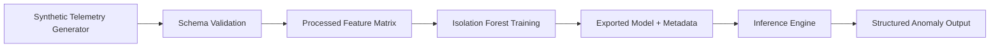
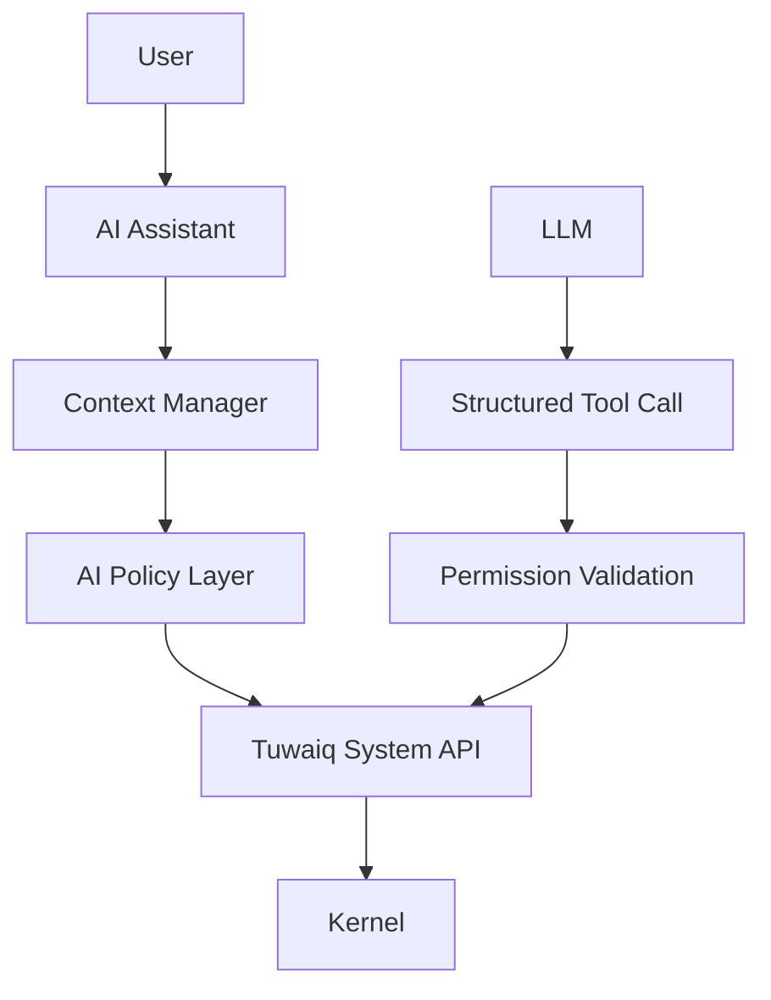

# Architecture

## Scope

This prototype is intentionally isolated under ai_development and is not integrated into TuwaiqOS runtime.

## Components

1. Tuwaiq AI Assistant (future)
- User interaction layer.
- Converts natural language questions into structured intelligence queries.
- Must pass through policy and permission checks.

2. Tuwaiq AI System Intelligence (prototype implemented)
- Telemetry data collection abstraction.
- Schema validation.
- Preprocessing and feature engineering.
- Isolation Forest anomaly detection.
- Structured inference and evaluation.

## Data and Control Flow

## Future Integration Boundary

Security boundary:
- LLM must not directly call kernel internals.
- Policy validation gate is mandatory.

## Telemetry Availability Statement

Current implementation uses synthetic telemetry only.
Any metric that depends on runtime kernel signals is treated as future integration requirement.

## Detection vs Diagnosis

- Detection: identifies statistically unusual behavior.
- Diagnosis: requires additional causal system instrumentation and is not claimed by this prototype.
