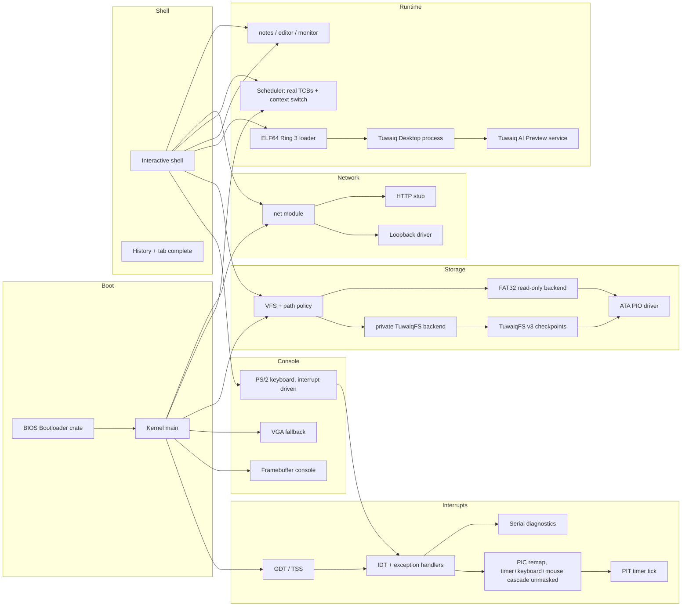

# TuwaiqOS Architecture

## Overview

TuwaiqOS is a monolithic bare-metal kernel written in Rust (`no_std`) with
hardware-isolated Ring 3 ELF processes. Core services remain in the kernel;
Phase 4 added per-process address spaces, Phase 5 runs the graphical desktop
as an unprivileged userspace process. Phase 6 adds a general VFS mount table,
recoverable persistent application data, a read-only FAT32 resource backend,
and filesystem-backed application launch as the normal path.



## Boot sequence

1. `bootloader` crate loads the kernel ELF from the BIOS disk image.
2. `kernel_main` enables `EFER.NXE` (`paging::enable_nx`, before any page
   table exists -- see Phase 4 below), initializes the heap, then
   interrupts (GDT/TSS, IDT, PIC remap + mask, PIT timer, `sti`), then ATA,
   VFS/TuwaiqFS, tasks, and network.
3. Framebuffer or VGA console starts; shell prints boot banner and prompt.

Interrupts must come immediately after the heap: the keyboard event queue
(`keyboard.rs`) allocates, and everything after this point in boot
(`ata::read_sector` polling loops in particular) runs with real hardware
interrupts live rather than a purely polled CPU.

## Kernel modules

| Module | Role |
|--------|------|
| `main.rs` | Entry point, subsystem init order |
| `serial.rs` | COM1 UART -- boot log and panic diagnostics, works headless |
| `gdt.rs` | GDT, TSS, dedicated IST stacks for double-fault and the keyboard IRQ |
| `interrupts.rs` | IDT, exception handlers, PIC remap/mask, PIT tick, `uptime` |
| `memory.rs` / `allocator.rs` | 4 MiB paged heap, `GlobalAlloc` |
| `paging.rs` | Frame allocator, `OffsetPageTable`, error-returning page mapping |
| `keyboard.rs` | Interrupt-driven PS/2 Set-1 scancodes, Shift, arrows, Tab |
| `mouse.rs` / `input.rs` | Bounded PS/2 mouse driver and exclusive foreground Ring 3 input queue |
| `display.rs` | Validated, atomic userspace-to-framebuffer presentation |
| `framebuffer_console.rs` | Scaled 8×8 font on bootloader FB |
| `vga_buffer.rs` | 80×25 text mode fallback |
| `shell.rs` | Command loop, history, completion |
| `vfs.rs` | Path policy, longest-prefix mount table, shell/process VFS facade |
| `fs.rs` | Private TuwaiqFS-backed in-memory tree implementation |
| `tuwaiqfs.rs` | TuwaiqFS v3 dual-checkpoint serialization and v2 migration |
| `fat32.rs` | Independent read-only MBR/BPB/FAT32 backend |
| `ata.rs` | Primary master PIO sector I/O |
| `task.rs` | Preemptive scheduler: real TCBs, per-task stacks, context switch, user-process lifecycle, CR3/RSP0 switching |
| `usermode.rs` | Low-level `iretq` primitive that drops CPL to 3 |
| `elf.rs` | Minimal ELF64 loader: validates and maps `PT_LOAD` segments into a process's address space |
| `syscall.rs` | Real syscall ABI: entry stub, dispatch, user-pointer validation |
| `loader.rs` / `programs/` | Built-in program registry |
| `apps/` | notes, editor, monitor |
| `net/` | Driver trait, loopback, HTTP stub |
| `ai_bridge.rs` | Offline AI stub for future gateway |
| `reboot.rs` | Sync FS + keyboard controller reset |

## Interrupts (GDT / IDT / PIC / PIT)

- **GDT/TSS** (`gdt.rs`): null, kernel code, TSS, and (Phase 4) a Ring 3
  code and data segment, plus two dedicated Interrupt Stack Table entries
  -- one for `#DF` (double fault), one for the keyboard IRQ, which never
  redirects control flow so a fixed stack is safe for it. The timer IRQ
  deliberately does **not** use an IST stack (see Scheduler below): as of
  Phase 3 it may perform a real context switch, which only works if the
  interrupt frame lands on *the currently running task's own stack* rather
  than a fixed physical one shared by every tick regardless of which task
  was running. The TSS is a plain mutable static rather than the
  `lazy_static`-immutable pattern used elsewhere in this file, specifically
  so its RSP0 field can be updated at runtime -- see Ring 3 foundation
  below.
  Loading a new GDT does **not** reload `SS`/`DS`/`ES`/`FS`/`GS` -- the
  bootloader's own (now-stale) selector values are explicitly reloaded to
  null here, which is load-bearing: skipping it produces a GPF on every
  single interrupt return, since `iretq` validates the stacked `SS`
  selector against the *current* GDT.
- **IDT** (`interrupts.rs`): handlers for breakpoint, double fault, page
  fault, general-protection fault, invalid opcode, and divide error, each
  logging full diagnostics over serial (and to the framebuffer console if
  it's confirmed active) before halting. A software breakpoint self-test
  runs immediately after the IDT loads, before any hardware interrupt is
  permitted to fire.
- **PIC remap**: legacy IRQs 0-15 are remapped to vectors 32-47. Boot first
  unmasks IRQ0 (timer) and IRQ1 (keyboard). After bounded PS/2 mouse
  initialization succeeds, IRQ2 (slave cascade) and IRQ12 are also unmasked;
  on absent/error paths they remain masked. `ChainedPics::initialize()`
  preserves whatever mask the BIOS left rather than resetting it, and
  SeaBIOS leaves several lines (IRQ14, the primary ATA/IDE controller,
  among them) unmasked by default. A hardware IRQ landing on any other,
  not-present vector is exactly what caused a double fault during bring-up.
- **PIT**: channel 0 programmed for a 100 Hz square-wave interrupt, driving
  a tick counter (`interrupts::ticks()` / `uptime_seconds()`) and letting
  the shell's input loop `hlt` between keystrokes instead of busy-spinning.
- **Keyboard**: scancodes arrive via IRQ1 and are decoded inside the ISR.
  `keyboard::poll_key()` retains the shell-facing drain-or-`None` API, while
  Phase 5 routes each decoded event exclusively to either that queue or the
  foreground Ring 3 input queue.

## TuwaiqFS v3

See [docs/TUWAIQFS.md](docs/TUWAIQFS.md). The binary-safe full tree is written
to alternating checksummed checkpoints. The commit header is written last;
mount chooses the newest valid generation or recovers the older committed
copy. Legacy v2 volumes are read with strict geometry and upgraded only after a
successful v3 checkpoint. Unrecoverable corruption leaves `/` offline instead
of silently formatting or substituting an empty tree.

## Program loader

`loader.rs` still dispatches `run <name>` to legacy built-in kernel programs.
`runelf` launches explicitly embedded Ring 3 recovery/test fixtures. Normal
desktop/application launch, `runfs`, and `SPAWN` read ELF bytes from `/apps`
through the VFS and the same validated `elf.rs` loader.

## Shell

- Prompt: `tuwaiq@os:~$` at root, `tuwaiq@os:/path$` elsewhere
- History: 16 entries, Up/Down recall
- Tab: completes commands, program names, and file names
- `clear`/`cls`: full screen wipe via framebuffer or VGA

## Memory model

- Stack: kernel stack provided by bootloader, plus two dedicated IST
  stacks installed via the TSS (double fault, and the keyboard IRQ only --
  the timer IRQ deliberately does **not** use IST as of Phase 3; see
  Scheduler below)
- Heap: 4 MiB of real virtual memory at a fixed address (`0x_4444_4444_0000`),
  backed by physical frames mapped in on demand -- not a static array
  anymore (see Paging below). Falls back to an equivalent-size static
  array if the bootloader ever fails to provide a physical memory offset,
  so a paging setup problem degrades the heap rather than failing to boot.
- The bootloader's own page tables do **not** map the legacy VGA text
  buffer (0xB8000) in this project's boot configuration -- writing to it
  from a fault/panic path will page-fault, which is why fault reporting
  only touches the framebuffer console (see `interrupts::report_fault`)
- User processes (Phase 4): own private stack + ELF segments in
  `0x_7000_0000_0000 .. +1 GiB`, own private page-table root -- see the
  Phase 4 section below for the full virtual-memory layout and isolation
  mechanism

## Paging (Phase 2)

- **Physical memory access**: `main.rs` opts into the bootloader mapping
  *all* physical memory at a dynamic virtual offset
  (`BootloaderConfig.mappings.physical_memory = Some(Mapping::Dynamic)`).
  Without this, `boot_info.physical_memory_offset` is `None` and no
  physical address is dereferenceable at all -- this is exactly why v0.5's
  heap was a static array instead.
- **Frame allocator** (`paging::BootInfoFrameAllocator`): bump-allocates
  4 KiB frames from the bootloader's `Usable` memory regions. Freed frames
  go onto a small pool and are reused before the bump cursor advances --
  a real allocator with working deallocation, not a stub that only ever
  hands out memory.
- **Mapper**: `paging::init` builds an `x86_64::structures::paging::OffsetPageTable`
  over the CPU's active level-4 table (read from `CR3`, translated to a
  virtual address via the physical memory offset above).
  `paging::map_page` wraps `Mapper::map_to` to return a `Result` instead
  of panicking on failure (out of frames, or the page is already mapped).
- **Heap**: `memory::init_heap` maps `HEAP_SIZE` worth of pages at
  `HEAP_START` with `PRESENT | WRITABLE`, then hands that range to the
  same `linked_list_allocator` as before -- `allocator.rs`'s public API
  didn't need to change, only what `init_heap` passes it did.
- **Diagnostics**: `sysinfo` and `monitor` show heap used/free bytes
  (`allocator::used()`/`free()`) and frame allocator stats
  (`paging::frame_stats()`) -- real numbers read from the live allocator
  state, not placeholders.
- **Global state**: the installed mapper and frame allocator live behind
  `spin::Mutex`, not a bare `static mut` -- Phase 3's scheduler is what
  will make them genuinely reachable from more than one execution context,
  and this is deliberately already safe for that before it exists.
- **Phase boundary**: Phase 2 itself stopped at kernel paging. Phase 4 has
  since added isolated per-process address spaces, and Phase 5 added anonymous
  mapping/unmapping. Swapping and paging to disk remain unimplemented.

## Scheduler (Phase 3)

`task.rs` replaces the old two-row decorative task table with a real
preemptive scheduler: `ps`/`taskinfo`/`kill` now report and act on genuine
execution state, not bookkeeping strings.

- **Task control block**: each task has its own heap-allocated 32 KiB
  stack (the boot task, id 1 "shell", is the one exception -- it runs on
  the stack the bootloader handed the kernel), a saved stack pointer, and
  a `Ready`/`Running`/`Blocked`/`Terminated` state.
- **Context switch**: `context_switch(old_rsp, new_rsp)` is hand-written
  assembly that looks like an ordinary `extern "C"` call from the Rust
  side, and that's the whole trick -- the System V calling convention
  already specifies that a normal call must preserve `rbx`/`rbp`/`r12`-`r15`
  and the stack pointer, and may clobber everything else (there are no
  callee-saved XMM registers in SysV at all). Saving exactly that set
  before switching `rsp` to a different task's stack, then restoring it
  and `ret`-ing, is a fully correct function call from the compiler's
  point of view; the "magic" is entirely in whose stack the `ret` address
  came from. See `task.rs`'s module docs for the complete walkthrough.
- **Why the timer interrupt no longer uses an IST stack**: a suspended
  task's entire call chain -- including the CPU-pushed interrupt frame --
  has to sit dormant on *that task's own stack* between switches, or
  there's nothing correct to resume later. An IST stack would force every
  timer tick onto the same fixed physical stack regardless of which task
  was running, destroying that. Keyboard keeps its IST stack: it never
  redirects control flow, so this doesn't apply to it.
- **Preemption**: `task::on_timer_tick` (called from the timer ISR) wakes
  any `Blocked` task whose sleep has elapsed, then preempts into the
  scheduler every 5 ticks (50 ms at the PIT's 100 Hz rate).
- **Primitives**: `spawn`, `yield_now` (also a shell command, `yield`),
  `sleep_ticks`, `exit`. A fresh task's first-ever entry runs through a
  small trampoline that explicitly re-enables interrupts (`sti`) before
  calling it -- a *resumed* task's interrupt-enable state is already
  correct via its own dormant call chain, but a brand new one has no such
  chain to inherit it from.
- **Demonstration**: a `heartbeat` task (id 3) is spawned at boot; it
  sleeps ~1 second and logs a beat count over serial, forever. Watching
  its count climb steadily in the serial log while the shell stays
  interactively responsive -- and while `kill 3` genuinely stops it, not
  just relabels it -- is the verification this phase's own engineering
  rules require before it counts as done, not just a clean compile.

## Phase 4: user-mode process model

Phase 4 replaced the milestone-1 Ring 3 *demo* (a hand-copied payload with
no address-space isolation, one shared page, one process at a time) with a
real process model: genuine ELF64 programs, each with its own private
address space, scheduled and preempted exactly like any kernel task, with a
real syscall interface and hardware-enforced fault isolation. This section
records that foundation and points to Phase 5 where current behavior extends
it; the earlier milestone's demo code
(`usermode.rs`'s payloads, the `usermode` shell command) no longer exists --
see git history for that snapshot if needed.

### Process model

A user process is a `task.rs` `Tcb` like any other, plus a `ProcessState`:
its own `paging::AddressSpace`, the ELF entry point and user stack top it
should start at, and (once it has run) an exit code. `ps`/`taskinfo` read
this genuine state -- nothing here is cosmetic:

- **PID** = task id (the same id space kernel tasks use; `sys_getpid`
  returns it directly).
- **Privilege**: `Privilege::Kernel` or `Privilege::User`, shown in `ps`.
- **State**: the same `Ready`/`Running`/`Blocked`/`Terminated` machinery
  Phase 3 already had -- a user process blocks, sleeps, and gets preempted
  through the identical scheduler path a kernel task does.
- **Own user stack**: a dedicated, `WRITABLE | USER_ACCESSIBLE | NO_EXECUTE`
  region mapped by `task::spawn_user_process` (4 pages, 16 KiB) inside the
  process's own address space.
- **Own kernel stack**: the same 32 KiB `Box<[u8; STACK_SIZE]>` every task
  already gets (`task::new_user_tcb`) -- this is what the TSS's RSP0 points
  at while this process is current (see below).
- **Own address-space/page-table root**: see the next section.
- **Lifecycle**: `task::spawn_user_process` (create + add to the
  scheduler) -> runs via the normal scheduling loop -> `task::exit_with_code`
  (via the `EXIT` syscall or fault-isolation recovery) marks it `Terminated`
  and records an exit code -> the next `schedule()` call that switches away
  from it frees its address space (see below).
- **Exit status**: `Task::exit_code`, `Some` once terminated. `ps`/`taskinfo`
  print it; `runelf`/`isolate` wait for it and report it.

No second scheduler was built: `task.rs`'s existing round-robin
`Scheduler`/`prepare_switch`/`schedule` loop is the *only* scheduler, and a
user process is simply a `Tcb` whose `process` field is `Some`.

### Ring 0 / Ring 3 boundary

- **GDT**: `gdt.rs` has null, kernel-code, TSS, and Ring 3 code/data
  descriptors (DPL=3; `Descriptor::user_code_segment()`/`user_data_segment()`,
  whose DPL `add_entry` encodes directly into the returned selector's RPL).
- **Entry into Ring 3**: `usermode::enter_ring3` -- a small hand-written
  `iretq` trampoline, the *only* place in this kernel that changes CPL. It
  builds the five-word interrupt-return frame (RIP, CS, RFLAGS, RSP, SS) by
  hand; `RFLAGS = 0x202` (`IF=1`, interrupts stay on; `IOPL=00`, so I/O port
  instructions fault from Ring 3 like every other privileged instruction).
  `task.rs`'s `rust_user_entry` (a new user task's very first run, reached
  through `user_task_trampoline`) is the only caller.
- **Return from Ring 3**: only ever through a trap -- the syscall gate
  (`int 0x80`, normal exit) or a fault (page fault / GPF, recovery exit).
  There is no "ordinary return" path; a user process's Ring 3 call stack is
  always abandoned, exactly like a kernel task's stack is abandoned on
  `exit()`.
- **TSS / RSP0**: `gdt::set_kernel_stack` writes `TSS.privilege_stack_table[0]`
  -- the stack the CPU switches to on *any* interrupt/exception/syscall that
  catches the CPU at CPL=3. `task::schedule()` calls it on **every**
  scheduler switch, with the incoming task's own kernel stack top (0 only
  for the boot "shell" task, which never runs Ring 3 code and so never
  consults RSP0). This is what removed Milestone 1's "only one Ring-3
  process at a time" limitation: RSP0 is a single CPU-global field, but it's
  now kept current on every switch, so whichever process is running always
  traps onto *its own* kernel stack, not some other process's.

### Per-process address spaces

- **Layout**: `paging::USER_SPACE_BASE = 0x_7000_0000_0000`,
  `USER_SPACE_SIZE = 1 GiB`. Every process's ELF segments and its stack
  live somewhere in this one range, which sits inside a single PML4 entry
  (`USER_REGION_PML4_INDEX`). Kernel mappings (heap at `0x_4444_4444_0000`,
  kernel image, physical-memory identity window, kernel/IST stacks) occupy
  entirely different PML4 entries and are untouched.
- **Construction** (`paging::new_address_space`): allocate a fresh PML4
  frame, copy all 511 *other* entries verbatim from the kernel's own
  top-level table (same physical subtree pointers, same flags -- copying an
  entry cannot change its `USER_ACCESSIBLE` bit, so kernel pages stay
  exactly as supervisor-only as they always were), and leave
  `USER_REGION_PML4_INDEX` completely empty. This is the actual isolation
  mechanism: two processes' private subtrees live under the same PML4
  index but are never the same physical subtree, so there is no shared
  page-table entry through which one could reach the other's memory, even
  though both may use the identical virtual address.
- **Mapping** (`paging::map_in_address_space`): maps one page into a given
  `AddressSpace`, independent of whether it's the active CR3 (via a
  physical-memory-offset-mapped `OffsetPageTable` built over that specific
  PML4 frame). Refuses anything outside `USER_REGION_PML4_INDEX` -- a second,
  independent check beyond `elf.rs`'s own range validation.
- **Frame ownership**: `AddressSpace` tracks every physical frame it owns
  (its own page-table subtree *and* every mapped leaf page) via a
  `TrackingFrameAllocator` wrapper that records each frame `map_to` hands
  out internally, including intermediate P3/P2/P1 tables `map_to` allocates
  opaquely. `free_address_space` (called once CR3 has moved off it -- see
  below) returns every one of them to the global allocator in one pass, no
  tree-walk needed.
- **CR3 switching**: `paging::switch_to` loads a `PhysFrame` into CR3.
  `task::schedule()` calls it on *every* switch (not only when the address
  space actually changes) with either the incoming user process's own PML4
  or `paging::kernel_pml4_frame()` for a kernel-only task -- reloading CR3
  to its current value is just a slightly wasteful TLB flush, a better
  trade than trusting a separately maintained "currently loaded" cache to
  never drift from reality.
- **Frame lifecycle / leak avoidance**: an address space is only ever freed
  once CR3 has provably moved off it (`free_address_space`'s own safety
  contract). For the common case -- a process terminating itself via `exit`
  or fault recovery -- `Scheduler::prepare_switch` takes the outgoing
  (Terminated, current) task's address space out of its `Tcb` while still
  holding the scheduler lock, and `schedule()` frees it *after* loading the
  new CR3 but *before* the actual stack switch. For `kill`-ing a
  *non-current* task, its address space is provably already inactive (CR3
  can only ever equal the current task's own), so `kill` frees it
  immediately rather than waiting for a future switch.
- **Spawn-failure cleanup**: `task::spawn_user_process` calls
  `paging::new_address_space` first, then `build_user_tcb` (ELF load, stack
  mapping, stack zeroing) and finally the scheduler push -- any one of
  which can fail. Because the address space is never installed into a
  `Tcb`, never reachable from the scheduler, and never scheduled until
  `build_user_tcb` returns a complete, ready-to-run `Tcb`, it is provably
  not the active CR3 at every failure point along the way -- so
  `build_user_tcb` frees it immediately (via a small `try_or_free!` macro
  wrapping each fallible step) rather than letting an early `?` return
  silently drop it and leak every frame allocated so far. The one
  remaining failure point (`with_scheduler` itself refusing the final
  push, in practice unreachable since `task::init()` always runs first)
  is handled the same way: the built `Tcb` is threaded through as an
  `Option` so it's still available to reclaim its address space if the
  push never happens. Verified with `spawnfail <count>` (`shell.rs`): N
  repeated, deliberately-failing spawns (after one untimed warm-up spawn)
  leave `paging::BootInfoFrameAllocator::frames_bumped()` -- the bump
  cursor over never-before-touched physical memory -- completely
  unchanged. That specific metric, not `frames_allocated() -
  frames_in_free_pool()`, is what a leak test needs: `frames_allocated()`
  counts every *call* to `allocate_frame`, including ones satisfied by
  reusing an already-freed frame, so it grows by one on every iteration
  regardless of whether anything actually leaked -- comparing it
  before/after reports a false "leak" on every run, even a perfect one
  (caught during this very verification pass: the first version of this
  test used that comparison and reported a leak that wasn't real). The
  bump cursor only advances when the free list is empty and a genuinely
  new frame has to be handed out, so it's flat if and only if every
  freed frame was actually returned to circulation.
- **Reaping (Phase 5)**: the Phase 4 leak is closed. Terminated TCBs and
  their 32 KiB kernel stacks are removed after a grace period or explicit
  reap; automatic and explicit-kill paths are both covered by lifecycle
  tests.

### Syscall ABI

`int 0x80`, DPL=3. `RAX` = syscall number on entry / return value on exit;
`RDI`/`RSI`/`RDX` = up to three arguments. `>= 0` is success, `-1` is a
generic failure -- no `errno`-style detail channel in this minimal ABI.

| # | name | args | returns |
|---|------|------|---------|
| 0 | EXIT | `code: i32` | never returns |
| 1 | WRITE | `ptr: *const u8, len: usize` | bytes written, or `-1` |
| 2 | YIELD | -- | `0` |
| 3 | GETPID | -- | this process's task id |
| 4 | MMAP | `len: usize, writable: bool` | chosen arena address, or `-1` |
| 5 | MUNMAP | `ptr: *mut u8, len: usize` | `0`, or `-1` |
| 6 | DISPLAY_INFO | `out_ptr: *mut u8, out_len: usize` | `0`, or `-1` |
| 7 | DISPLAY_PRESENT | `ptr: *const u8, len: usize` | `0`, or `-1` |
| 8 | INPUT_POLL | `out_ptr: *mut u8, out_len: usize` | `1`, `0`, or `-1` |
| 9 | UPTIME_TICKS | -- | 100 Hz tick count |
| 10 | CHDIR | `path_ptr: *const u8, path_len: usize` | `0`, or `-1` |
| 11 | GETCWD | `out_ptr: *mut u8, out_len: usize` | path byte count, or `-1` |
| 12 | OPEN | `path_ptr: *const u8, path_len: usize` | read handle, or `-1` |
| 13 | READ | `handle: u32, out_ptr: *mut u8, out_len: usize` | bytes read, or `-1` |
| 14 | CLOSE | `handle: u32` | `0`, or `-1` |
| 15 | SPAWN | `path_ptr: *const u8, path_len: usize` | child pid, or `-1` |

Any other number: `-1`, logged, the process keeps running (`syscall.rs`
`dispatch`'s `_` arm) -- unknown syscalls fail safely rather than crashing
anything.

**Entry mechanism**: `syscall_entry` (`syscall.rs`) is hand-written asm, not
`extern "x86-interrupt"` -- that calling convention only exposes the
CPU-pushed frame, not general-purpose registers, and this ABI needs to read
`RAX`/`RDI`/`RSI`/`RDX` and write a return value back into `RAX`. It saves
all 15 GPRs (verified 16-byte SysV stack alignment at the `call` into Rust:
120 bytes of pushes plus the CPU's own 40-byte privilege-change entry
adjustment lands exactly on a 16-byte boundary), calls into
`syscall_dispatch`, restores every register (`RAX` now holding the result),
and `iretq`s back to Ring 3. `int 0x80` is an interrupt gate, so the CPU
clears `IF` on entry. Short syscalls remain non-preemptible. Large
MMAP/MUNMAP transactions explicitly enable interrupts only between bounded
scheduler/paging lock scopes; the current single-threaded process cannot
execute Ring 3 code during that interval, so its transaction stays race-free
while PIT preemption and peer tasks continue.

**Pointer validation**: WRITE, MUNMAP, DISPLAY_INFO, DISPLAY_PRESENT, and
INPUT_POLL accept Ring 3 addresses. All use fallible canonical-address
construction, caller-user-region bounds, checked range arithmetic, and a
complete per-page permission walk (`PRESENT | USER_ACCESSIBLE`, plus
`WRITABLE` for copy-out) before access. `sys_write` first rejects
`len > 4096` outright, then calls
`task::copy_from_current_user`, which walks the *calling* process's own
page tables (`paging::translate_in_address_space`, then
`read_bytes_from_address_space`) and only copies bytes once every page in
`[ptr, ptr+len)` is confirmed `PRESENT | USER_ACCESSIBLE` (checked
arithmetic throughout -- an overflowing `ptr+len` is rejected, not wrapped).
The kernel's own physical-memory-offset mapping is the only thing ever
dereferenced; a user-supplied pointer's numeric value is never trusted or
dereferenced directly under the live CR3. An invalid pointer or range is a
clean `-1`, never a Ring 0 page fault from kernel code blindly trusting
user input.

### ELF64 loader

`elf.rs`. Supported subset, documented exactly (see the module's own docs
for the full list): `ELFCLASS64`, `ELFDATA2LSB`, `ET_EXEC` only (no
relocations/PIE -- every address in the file must already be final),
`EM_X86_64`, only `PT_LOAD` segments processed (`PT_DYNAMIC`/`PT_INTERP`
reject the whole file; anything else is silently skipped), no section
headers read at all. Every offset/size taken from the file goes through
checked arithmetic before use.

Two passes: the first validates and rejects the *entire* file if anything
is malformed or unsupported, before mapping a single page -- a partially
loaded process is never a thing this loader can hand control to. The
second pass maps each segment's pages `WRITABLE` first (so the kernel-side
copy can populate it through the physical-memory-offset path), zeroes the
*entire* freshly mapped range (not just the BSS tail -- a reused physical
frame must never leak a previous process's contents to a new one), copies
in the file bytes, then narrows the pages to their real, final permissions
via `paging::update_flags_in_address_space` if those differ from the
staging flags. A segment's `p_flags` map directly: `PF_X` absent ->
`NO_EXECUTE` added (meaningful only because `paging::enable_nx` already ran
at the very start of `kernel_main`, before any page table exists); `PF_W`
present -> `WRITABLE` kept, otherwise dropped once loading finishes.

### Process / fault lifecycle

| Trigger | Path | Result |
|---|---|---|
| `EXIT` syscall | `syscall::sys_exit` -> `task::exit_with_code` | Process terminates with the given code; kernel continues |
| Privileged instruction at CPL=3 | GPF, `code_segment & 3 == 3` -> `task::exit_with_code(132)` | Only that process terminates; kernel continues |
| Kernel-memory / unmapped access at CPL=3 | Page fault, `code_segment & 3 == 3` -> `task::exit_with_code(139)` | Only that process terminates; kernel continues |
| Invalid opcode (`#UD`, e.g. `ud2`) at CPL=3 | `invalid_opcode_handler`, `code_segment & 3 == 3` -> `task::exit_with_code(132)` | Only that process terminates; kernel continues |
| Divide error (`#DE`, divide/mod by zero) at CPL=3 | `divide_error_handler`, `code_segment & 3 == 3` -> `task::exit_with_code(136)` | Only that process terminates; kernel continues |
| Invalid syscall number | `syscall::dispatch`'s `_` arm | `-1` returned; process keeps running |
| Invalid user pointer to `WRITE` | `task::copy_from_current_user` returns `None` | `-1` returned; process keeps running |
| Any fault at CPL=0 (including `#UD`/`#DE`) | Same handlers, `code_segment & 3 != 3` | Unconditional halt -- unchanged kernel-panic policy, never routed around |

The exit codes (139/132/136) deliberately echo the Unix "128 + signal
number" convention (SIGSEGV=11, SIGILL=4, SIGFPE=8) purely as a
recognizable value in `ps` output -- this kernel has no real signal
delivery. `#UD` shares `SIGILL`'s exit code with a Ring 3 `#GP`
(privileged instruction): both are "the CPU refused to execute this
instruction," the same category a real kernel would report identically.

Every one of these five Ring-3-origin recovery paths follows the same
CPU-verified pattern first established for `#GP`: the trapped `code_segment`'s
low two bits are the CPL the faulting instruction actually executed at
-- stamped there by the CPU itself when building the interrupt frame, not
something the interrupted code could spoof -- so the RPL==3 check is
hardware-verified evidence, not a heuristic.

### Known limitations

- Single, fixed 1 GiB private user range per process; no ASLR or growth
  beyond it. Phase 5 adds a bounded anonymous mmap arena inside that range.
- At Phase 4 completion there was no dynamic linking, relocation, or
  filesystem-backed executable loading. Phase 6 now supplies the initial
  filesystem path; dynamic linking and relocation remain future work.
- At Phase 5 completion the syscall surface contained 10 calls and no file
  API. Phase 6 extended it to 22 calls; the Phase 8 IPC/capability foundation
  extends it to 37 (`docs/IPC_ABI.md`), including `capability_query`. The broader
  native ABI is not yet declared stable.

### Verification performed

All of the following were exercised live in QEMU in a single session (see
the Phase 4 completion PR, and its acceptance-review follow-up commit, for
full serial-log/screenshot evidence):
real ELF execution at CPL=3 with a full syscall round trip (`runelf hello`);
an unknown syscall number safely rejected (`runelf bad_syscall`); an
invalid user pointer safely rejected (`runelf bad_pointer`); direct kernel-memory
access denied by hardware (`runelf bad_kernel`); unmapped-memory access
faulting correctly (`runelf bad_unmapped`); a privileged instruction
trapped and recovered (`runelf bad_privileged`); an invalid opcode (`ud2`)
trapped and recovered (`runelf bad_ud2`); a divide-by-zero trapped and
recovered (`runelf bad_divzero`); two concurrent processes with distinct,
hardware-confirmed PML4 physical addresses running under real timer
preemption with interleaved output (`isolate`); a faulting process (one of
`bad_privileged`/`bad_ud2`/`bad_divzero`) leaving a concurrently running
sibling and the kernel itself unaffected (`isolate <bad_program>`);
physical-frame accounting (`paging::frame_stats`) returning to its exact
pre-loop baseline after 25 repeated deliberately-failing `spawn_user_process`
calls (`spawnfail 25`), confirming the address-space-cleanup fix reclaims
every frame on every failure path rather than leaking any of them; the
full Phase 1-3 regression checklist; and TuwaiqFS content surviving a full
VM reset.

## Phase 5: userland runtime and the first Tuwaiq Desktop

Phase 5 turns the Phase 4 process model into enough of a real userland
runtime to run a genuine graphical desktop: reclaiming the memory Phase 4
left leaking, a minimal anonymous-memory ABI, a kernel display abstraction
with a validated present path, a real PS/2 mouse driver, a unified
keyboard+mouse input queue, and the Tuwaiq Desktop itself -- a real Ring 3
ELF64 process with a small userspace window compositor. This is the
**first** desktop milestone: a background, a system bar, a working cursor,
one movable/closable window type, and keyboard/mouse interaction that
visibly reaches userspace -- not a claim that TuwaiqOS is a general-purpose
desktop OS yet. Kernel policy stays exactly what Phase 4 established
(mechanism in the kernel, policy in userspace); nothing here weakens that.

### Process lifecycle cleanup (reaping)

Phase 4 documented a known leak: a `Tcb` was never removed from the
scheduler's task list once `Terminated`, so its 32 KiB kernel-stack `Box`
(and, after this phase, its `Tcb` slot) accumulated forever across repeated
process creation. Fixed in `task.rs` with grace-period reaping rather than
immediate removal:

- `Tcb` gains `terminated_at_tick: u64`, stamped by both `exit_with_code`
  and `kill` the moment a task becomes `Terminated`.
- `Scheduler::reap_terminated(force: bool)` removes every `Terminated` task
  (other than the currently running one -- reaping your own still-executing
  context is never safe) whose `terminated_at_tick` is at least
  `REAP_GRACE_TICKS` (500 ticks, 5s at 100 Hz) in the past, or unconditionally
  when `force` is set. Freeing a reaped process's `AddressSpace` reuses the
  exact same `paging::free_address_space` path Phase 4's `kill`/`schedule`
  already used -- no new frame-reclamation logic, just a new caller.
- Called automatically at the top of every `prepare_switch()` (so reaping
  is continuous background housekeeping, not something a caller has to
  remember to invoke) and, for deterministic testing, via `task::reap_now()`
  (force = true).
- The grace period exists so `runelf`/`isolate`'s existing
  `wait_for_terminated` -> `print_process_result` pattern keeps working
  unchanged: both read a terminated task's final state immediately after it
  exits, and reaping it out from under that read would turn real exit-code
  evidence into a "task not found" error. 5 seconds is far longer than any
  shell command's own read-back takes.
- `reap <count>` (`shell.rs`) is the measurable proof: spawn/wait `count`
  `hello` processes back to back (each left `Terminated` but held by the
  grace period), force-reap everything, and compare both the live task
  count and the frame allocator's bump cursor before/after. A stable task
  count proves no leaked `Tcb`s; a stable bump cursor proves every
  process's address-space frames were genuinely returned to the free pool
  and reused by the next spawn, not merely freed-and-abandoned.

### User memory ABI (`SYS_MMAP` / `SYS_MUNMAP`)

A minimal, TuwaiqOS-specific anonymous-memory primitive rather than a
general POSIX `mmap` -- no file backing, no fixed-address requests, no
protection-flag bitmask, because none of those are needed yet and a
narrower ABI is easier to keep provably safe.

- **Arena**: `paging::USER_MMAP_BASE = USER_SPACE_BASE + 256 MiB`,
  `USER_MMAP_LIMIT = USER_SPACE_BASE + USER_SPACE_SIZE - 1 MiB` -- placed
  well clear of where ELF segments load (bottom of the 1 GiB region,
  always small in practice) and the user stack (top ~20 KiB), inside the
  same per-process `USER_REGION_PML4_INDEX` Phase 4 already isolates.
- **Allocation** (`task::mmap_in_current_process(len, writable)`): a simple
  bump allocator over `ProcessState::mmap_next`, one process-local field,
  no shared/global state. `len` is validated (checked page-count rounding,
  rejects zero and anything above `MAX_MMAP_LEN` = 64 MiB) before any page
  is touched, and the bump cursor is checked against `USER_MMAP_LIMIT`
  before mapping anything. Each page is mapped `PRESENT | WRITABLE |
  USER_ACCESSIBLE` first (so the kernel-side zeroing pass can populate it),
  zeroed, then narrowed to read-only if the caller didn't ask for
  `writable` -- `NX` (no-execute) is implicit: mmap'd pages are always data,
  never marked executable, so a process can never turn a writable buffer
  into code to run. The full destination is preflighted; mapping, zeroing,
  and final permissions run in four-page transactions with interrupts enabled
  between lock scopes. Any failure rolls back mapped leaves, reclaims newly
  empty P1-P3 tables, verifies the exact pre-call address-space frame count,
  and leaves `mmap_next` unchanged.
- **Release** (`task::munmap_in_current_process(ptr, len)`): validates page
  alignment and that the entire `[ptr, ptr+len)` range falls inside
  `[USER_MMAP_BASE, mmap_next)` -- i.e., genuinely came from this process's
  own prior `mmap` calls -- before unmapping anything. The kernel records the
  complete leaf set before mutation, removes it in bounded batches while
  retaining ownership, restores earlier batches if any later removal fails,
  and only then returns leaf frames to the global pool and prunes newly empty
  P1-P3 tables in bounded ranges. A rejected unmap therefore changes no
  mapping or allocator ownership. Since the
  arena is a bump allocator with no free list, a freed range's virtual
  addresses are not reused by later `mmap` calls in the *same* process --
  a documented, deliberate simplification, not a leak (the physical frames
  themselves are fully reclaimed and reused by any process).
- **Isolation**: `MMAP` does not accept a requested address, so allocation
  outside the caller's arena is not expressible. `MUNMAP(ptr, len)` does accept
  an address; it rejects noncanonical, overflowing, unaligned, out-of-arena,
  unowned, or partially unmapped ranges before changing any leaf.
- **Security-hardening side effect**: designing `SYS_MMAP` alongside
  `SYS_DISPLAY_INFO`/`SYS_INPUT_POLL` (the first syscalls to write kernel
  data into a Ring-3-controlled destination pointer) surfaced a latent gap
  in `paging::for_each_mapped_chunk`, the helper Phase 4's `WRITE` pointer
  validation is built on: it checked the destination was `WRITABLE` but not
  `USER_ACCESSIBLE`. Every Phase 4 caller's destination was always
  kernel-computed and already `USER_ACCESSIBLE`, so this was never
  exploitable before Phase 5 -- but a new syscall accepting a raw
  destination pointer could otherwise have let a process pass a
  `WRITABLE`-but-supervisor-only kernel address and get the kernel to write
  into arbitrary kernel memory. Fixed by adding the `USER_ACCESSIBLE` check
  to the shared helper before any new syscall used it, closing the gap for
  every current and future caller at once.
- **Tests**: `bad_mmap`, `bad_munmap`, and `mmap_exhaustion` cover zero/huge
  lengths, rounding, bounds, zero-fill, write/read, noncanonical/overflowed/
  partial/double unmaps, exhaustion rejection, exact leaf/page-table rollback,
  physical-frame reuse, and PIT progress during 64 MiB map/unmap. `mmap_ro_fault`,
  `mmap_nx_fault`, and `post_unmap_fault` verify CPU permissions.

### Display subsystem

`display.rs` turns the raw framebuffer `framebuffer_console.rs` already
owned into a controlled interface for Ring 3:

- **`SYS_DISPLAY_INFO`**: writes a fixed 20-byte little-endian record
  (`width, height, stride, bytes_per_pixel, pixel_format` -- all `u32`;
  `stride` is in pixels, matching `bootloader_api`'s own field, so a
  renderer computes a byte offset as `(y * stride + x) * bytes_per_pixel`)
  into a caller-supplied buffer, through the same `USER_ACCESSIBLE`-checked
  `task::copy_to_current_user` path `WRITE` uses.
- **`SYS_DISPLAY_PRESENT`**: the *only* path that ever writes into the real
  framebuffer on a process's behalf. Userspace never receives a pointer to
  real framebuffer memory, ever -- it renders into its own `SYS_MMAP`'d
  buffer and submits the finished frame through this syscall.
  `display::present` validates, in order, before copying a single byte:
  a display must actually be active; the caller's buffer length must
  *exactly* equal the real framebuffer's byte length (not "at least" --
  exact, so a mismatched buffer is always rejected rather than silently
  truncated or read out of bounds); every page of the caller's buffer must
  be mapped `PRESENT | USER_ACCESSIBLE` in the caller's own address space.
  Only the foreground process may present. A full-range preflight completes
  before the physical framebuffer is touched, so a bad later page changes zero
  framebuffer bytes. The validated frame then copies in 64 KiB chunks with an
  IRQ delivery window between chunks. The single-threaded caller cannot change
  its mapping while suspended, its CR3 is restored before it resumes, and no
  competing process can interleave a present. Avoiding both an intermediate
  multi-megabyte `Vec` and a redundant second page-table walk keeps each
  validation/copy critical section bounded without changing scheduler policy.
- **Negative tests** (`bad_display.rs`): kernel, noncanonical, cross-page,
  unmapped, partially mapped, and wrong-sized buffers are rejected. The shell
  compares full-framebuffer checksums before/after the hostile process to prove
  rejected presents are destination-atomic.

### PS/2 mouse driver

`mouse.rs`, IRQ12 (routed through the slave PIC's cascade line, IRQ2 on
the master -- both must be unmasked, or no slave-PIC interrupt reaches the
CPU regardless of IRQ12's own mask bit).

- **Bring-up** (`mouse::init`, called from `main.rs` right after
  `interrupts::init`): the standard 8042 sequence -- enable the auxiliary
  device (`0xA8`), enable its IRQ and clock in the controller's config byte
  (`0x20`/`0x60`), then `0xF6` (set defaults) / `0xF4` (enable streaming)
  sent to the mouse itself via the `0xD4` "next byte to auxiliary device"
  prefix, with bounded controller waits, ACK/RESEND handling, and a 200 Hz
  sample rate. Initialization runs with interrupts disabled so IRQ1 cannot
  consume controller replies. `interrupts::enable_mouse()` unmasks IRQ12 + the IRQ2 cascade
  line **only after** `mouse::init` has finished programming the device --
  never the reverse, which could deliver an interrupt to a still-mid-configuration
  device or a not-yet-ready packet-sync state. The keyboard's IRQ1 line is
  untouched by any of this (`interrupts::init`'s original mask logic for it
  is unchanged). If the controller/device is absent or rejects setup, boot
  continues with IRQ12 masked.
- **Packet decode** (`mouse::on_byte`, called from the new
  `mouse_interrupt_handler`): standard 3-byte PS/2 packets, resynchronized
  on the fly via the packet's own sync bit (byte 0, bit 3, always set) --
  a byte arriving where a sync bit is expected but absent is dropped rather
  than assembled into a garbage packet, so a single dropped/extra byte
  anywhere in the stream self-heals within one packet. Signed X/Y deltas
  (sign bits in byte 0), overflow-flagged packets discarded outright, Y
  inverted (PS/2 reports +Y as "up"; screen coordinates grow downward).
  Position is absolute and clamped to `[0, display::info().width/height)`
  every update -- a desktop process never has to replicate that
  bookkeeping or risk drawing a cursor off-screen. Left/right/middle button
  *edges* (not just presses) are detected by comparing each packet's button
  bits to the previous packet's, so a release is a real, distinct event.

### Unified input ABI (`input.rs` / `SYS_INPUT_POLL`)

A single bounded queue (`VecDeque`, capacity 64, same
lock-with-`without_interrupts` pattern as every other ISR-fed queue in this
kernel -- `keyboard::QUEUE`, `task::SCHEDULER`, `paging`'s global locks)
merging keyboard and mouse events for Ring 3 consumption:

- **`InputEvent`**: `KeyDown { code }` / `MouseMove { x, y }` /
  `MouseButton { button, pressed }`, encoded as a fixed 8-byte
  little-endian record (`SYS_INPUT_POLL`'s consumers never need a
  variable-length or unbounded buffer). No `KeyUp`: the existing keyboard
  scancode decoder (`keyboard.rs`) does not track release state for
  ordinary keys, only internally for Shift -- adding that is future work,
  not faked here with a synthetic release that never actually corresponds
  to a real key-up.
- **Exclusive ownership**: `keyboard.rs` tracks either shell ownership or one
  foreground process id. A decoded key goes to exactly one queue. Transitions
  run with interrupts disabled and clear both queues, so desktop keystrokes
  cannot accumulate and later replay as privileged shell commands. Mouse
  events enter the Ring 3 queue only while a foreground process owns input.
- **`SYS_INPUT_POLL(out_ptr, out_len)`**: drains one event if the queue is
  non-empty (return `1`), returns `0` immediately if empty (not an error --
  a desktop's main loop polls every frame and is expected to see this
  constantly, so it stays cheap and non-blocking), `-1` for an undersized
  or invalid destination buffer. It validates the destination before reading
  queue state or popping: invalid pointers fail even on an empty queue, and a
  queued event survives a rejected copy. Only the foreground pid may poll.
- **Negative tests** (`bad_input.rs`): deterministic seeded-event coverage
  proves invalid kernel/noncanonical/cross-page destinations do not consume
  the event; retrying with a valid buffer returns the same encoded `Z` event.

### Tuwaiq Desktop (userspace)

`userland/hello/src/bin/desktop/` -- a real ELF64 Ring 3 process, built and
loaded through exactly the same `task::spawn_user_process` /
`shell.rs::embedded_program` path as `hello` and every `bad_*` test binary
(the `desktop` shell command is a thin wrapper over `runelf`'s own spawn
logic, no kernel-side special case for this program). `#![no_std]` with no
`alloc` at all -- every data structure is a fixed-size array, matching this
process's genuinely allocator-free execution environment.

- **Rendering** (`gfx.rs`): software-only, into a `SYS_MMAP`'d backbuffer
  sized exactly to `DisplayInfo::buffer_len()` (`stride * height *
  bytes_per_pixel`, matching what `DISPLAY_PRESENT` requires byte-for-byte).
  Per-pixel format handling (RGB / BGR / U8 grayscale) mirrors
  `framebuffer_console.rs`'s own `write_pixel` on the kernel side. An 8x8
  glyph table (`font.rs`) is duplicated byte-for-byte from
  `kernel/src/font8x8.rs` (public domain) -- the desktop renders its own
  text entirely in its own memory; it does not and cannot call back into
  the kernel's text console.
- **Window model** (`window.rs`, Milestone 7): intentionally small --
  fixed-capacity array (`MAX_WINDOWS = 4`), back-to-front z-order,
  rectangular hit-testing, a title-bar drag region, and a close box. Window
  *policy* (what happens on a click, how many windows exist, what a window
  contains) lives entirely here in userspace; the kernel has no concept of
  a window at all, only a validated pixel buffer and a present syscall.
- **Main loop** (`main.rs`): poll every queued input event
  (`SYS_INPUT_POLL`, drained in a loop each frame so a burst of mouse
  packets between two of this process's time slices never visibly lags the
  cursor) -> update cursor position / window drag state / the launcher and
  key-log. It redraws/presents only on first frame, input changes, or a clock
  tick; idle iterations yield without touching the framebuffer. Escape
  requests a normal exit after unmapping the backbuffer. Cooperative yielding,
  not a busy spin, preserves ordinary round-robin fairness.
- **What's visibly on screen**: a dark background and system bar with a
  restrained green accent (Tuwaiq identity, not a neon demo effect or a
  clone of an existing desktop's chrome), "TuwaiqOS" branding, a live
  HH:MM:SS clock derived from `SYS_UPTIME_TICKS` (100 Hz, the same
  `interrupts::TIMER_HZ` this kernel has used since Phase 1), a "+ Launch"
  button that spawns a new movable/closable panel window each click (up to
  `MAX_WINDOWS`), one panel present from startup, and a rolling log of
  recently typed printable characters at the bottom of the screen -- the
  visible proof that keyboard input genuinely reaches this process.

### Security boundaries (Phase 5 additions)

Every new kernel/user boundary follows the same rule Phase 4 established:
never trust a Ring 3 pointer, argument, or length; validate before touching
memory; fail with `-1`, never a kernel fault, on anything invalid.

- `SYS_MMAP` chooses an address inside the caller's arena; `SYS_MUNMAP` accepts
  `ptr,len` but prevalidates canonicality, overflow, alignment, arena bounds,
  mappings, and ownership for the entire range before mutation.
- `SYS_DISPLAY_PRESENT` requires an *exact* buffer-length match and a full
  per-page `PRESENT | USER_ACCESSIBLE` validation of the entire source
  range before copying anything -- an oversized, undersized, or partially
  unmapped buffer is rejected outright. Only the foreground process may
  present, and validated copying opens interrupt windows between bounded
  64 KiB chunks.
- Every raw Ring 3 pointer goes through `VirtAddr::try_new`, private-user-range
  bounds, checked arithmetic, and complete page permission validation.
  `SYS_DISPLAY_INFO`/`SYS_INPUT_POLL` additionally require writable pages.
- A process that exits or faults while it owns an `mmap`'d graphics buffer
  or is mid-`DISPLAY_PRESENT` is handled by the same fault/exit machinery
  as any other process: its address space (and every frame it owns,
  buffers included) is reclaimed by the existing reaping/`kill` path; nothing
  Phase 5 added needs its own separate cleanup path, because ownership of
  every new resource (mmap'd pages, in particular) lives inside the
  process's own `AddressSpace`, exactly like its ELF segments and stack
  always have.
- Mouse and keyboard IRQs share the same interrupt-safe locking discipline
  as every other queue in this kernel (see "Locking invariant" below) --
  a timer interrupt landing mid-`SYS_INPUT_POLL`, or a mouse/keyboard IRQ
  landing mid-scheduler-operation, cannot deadlock, by the same invariant
  Bugs 1-4 established and this phase's new locks were audited against
  before being added, not after.

### Known limitations

- The mmap arena is a pure bump allocator with no free list: a `munmap`'d
  range's virtual addresses are not reclaimed for reuse within the same
  process (the underlying physical frames are still fully reclaimed and
  reused globally). A process that mmaps and munmaps in a tight loop will
  eventually exhaust the roughly 767 MiB virtual arena even though physical
  memory pressure never changes. The 64 MiB value is the cap for one MMAP
  request, not the arena size.
- No `KeyUp` events -- `keyboard.rs`'s scancode decoder doesn't track
  per-key release state for ordinary keys yet, so `InputEvent::KeyDown` is
  the only keyboard event kind.
- The window model supports exactly one interaction at a time (drag *or*
  close *or* raise-to-front on a given click) and does not support
  minimizing, resizing, or overlapping-window-aware redraw optimization --
  each dirty update still redraws and presents the entire backbuffer rather
  than tracking dirty rectangles. Idle loop iterations do not redraw.
  Deliberately small: this is the first window model, not a general compositor.
- `MAX_WINDOWS = 4`, fixed at compile time, no heap in this process to grow
  it dynamically.
- At Phase 5 acceptance the desktop was launched from an embedded ELF binary
  (`shell.rs::embedded_program`), the same mechanism every `runelf` test
  program already used. The Phase 6 section below records the first
  filesystem-backed replacement path; embedding is not removed yet.
- `TIMER_HZ` (100) is duplicated as a documented assumption in the
  desktop's own clock code rather than exposed via a syscall; if the
  kernel's timer frequency ever changes, this constant needs updating
  alongside it.

### Phase 5 Verification Performed

The project-side acceptance path is reproducible and assertion-driven; it does
not depend on an external scratch directory:

```powershell
powershell -NoProfile -ExecutionPolicy Bypass -File scripts\build.ps1
powershell -NoProfile -ExecutionPolicy Bypass -File scripts\phase5-acceptance.ps1
```

The harness refuses the wrong branch or a dirty final candidate, copies and
hashes the built image, boots 128 MiB QEMU through TCP serial/monitor channels,
fails on a missing marker/timeout/kernel fault, reboots the same image for
filesystem persistence, and performs a second `pc,i8042=off` boot for the
bounded mouse-absent path. Development-only runs may use `-AllowDirty`; a
development exhaustion skip is explicitly recorded as `SKIP` and
`DEVELOPMENT-SKIPPED`, never PASS. Concise JSON, serial, manifest, and PPM
evidence is written under `target/phase5-acceptance/` (ignored build output).

The 2026-08-08 acceptance pass exercised:

- boot, GDT/TSS, breakpoint/exception handling, PIC/PIT at 100 Hz, keyboard,
  initialized PS/2 mouse/IRQ12, heap, paging, physical-frame reuse, shell, and
  the built-in loader;
- real ELF execution, the 10-call syscall ABI, unknown-syscall rejection,
  distinct PML4s, two preempted Ring 3 processes, and isolated page-fault,
  privileged-instruction, invalid-opcode, and divide-error recovery;
- all pointer-bearing syscalls with zero, kernel, noncanonical, unmapped,
  overflowing, huge, cross-page, cross-user-boundary, partial, read-only, and
  wrong-length inputs. DISPLAY_PRESENT rejection preserved an exact physical
  framebuffer checksum; INPUT_POLL preserved a seeded event across invalid
  destinations and validated invalid pointers while empty;
- MMAP zero-fill, rounding, bounds, writable/read-only and NX enforcement,
  exhaustion rejection, injected post-mutation rollback, unchanged-address
  retry, exact leaf and page-table-frame ownership restoration, MUNMAP
  full-range atomicity, double/partial rejection, post-unmap CPU fault, frame
  reclamation, and zero-filled reuse;
- automatic grace-period reap, explicit kill/reap, failed-spawn rollback, and
  20 desktop start -> successful first present -> normal Escape exit -> reap
  cycles. Task count, live frames, frame bump cursor, and kernel heap/stack
  usage returned to warmed baselines;
- foreground input isolation by typing `reboot` and `kill 1` into the desktop,
  exiting, and proving neither command reached the privileged shell;
- live pointer movement, nonzero-coordinate window drag, focus/z-order, close,
  launcher, keyboard echo, normal exit/relaunch, a concurrent Ring 3 peer, a
  faulting peer, forced desktop termination, shell recovery, and heartbeat
  progress after graphics stress;
- TuwaiqFS create/write/read, a genuine machine reboot, persisted file content,
  and a post-reboot Ring 3 launch; plus a mouse-absent boot that kept IRQ12
  masked and the scheduler alive.

Measured dirty-candidate results before the final clean-commit rerun were:

- mouse queue age improved from the audited 6-tick/60 ms baseline to 1 tick
  maximum in the live interaction sequence (the gate permits at most 2 ticks),
  with adjacent move coalescing and zero dropped events;
- the former 64 MiB VM blackout took 30.942 s with PIT suppressed. Batched VM
  transactions reduced the full allocation/rejection/unmap/reuse sequence to
  9.288 s while PIT advanced during both large syscalls. Critical sections
  averaged 21 milli-ticks (~0.21 ms); the observed QEMU/host tail was 5194
  milli-ticks (~51.9 ms), under the 100 ms hard gate;
- after full-range preflight, full-frame present copies in 64 KiB batches with
  interrupt windows between them. Only the foreground process may present, so
  another process cannot interleave a competing frame. The acceptance gate
  measures the longest validation/copy critical section against one 50 ms
  scheduler quantum; the focused remeasurement was 1414 milli-ticks
  (~14.1 ms). The desktop avoids presents entirely while idle;
- the kernel build retained the pre-existing 9 warnings and added zero new
  warnings. Rust formatting and `git diff --check` are final gates.

Security invariants retained by these tests: malformed Ring 3 values never use
panicking address construction; validation precedes mutation; one process
cannot address another's private subtree; failed mapping/unmapping does not
advance or partially expose the arena; deferred unmap frames cannot be reused
before commit; input has one foreground owner; and no user fault, display/input
request, mouse error, or desktop lifecycle event can halt Ring 0.

## Phase 6 foundation: VFS, file ABI, and filesystem applications

This section describes the completed Phase 6 storage/application boundary.
TuwaiqFS is the writable root, FAT32 is a genuinely separate read-only backend,
mutations remain confined to per-application data directories, and embedded
ELFs are no longer the normal application-launch path.

### Current storage and path boundary

`vfs.rs` owns path policy and dispatches the root mount through a private
backend contract; `fs.rs` is the concrete TuwaiqFS tree and no syscall or
application receives a backend node. Current topology is:

```text
shell / Ring 3 syscalls
        |
        v
VFS normalization + longest-prefix mount table
        |                              |
        v                              v
TuwaiqFS backend at /             FAT32 backend at /boot
        |                              |
        v                              v
v3 dual checkpoints                validated read-only FAT chains
        |                              |
        +------------- ATA PIO --------+
```

- Paths are UTF-8, at most 120 bytes (the TuwaiqFS record bound),
  with components at most 64 bytes.
  Absolute and per-process-relative paths share one normalizer. Empty
  components and `.` are removed; `..` pops one component and clamps at `/`.
  NUL/control bytes and backslashes are rejected.
- The privileged shell and every Ring 3 process own independent normalized
  working directories. `cd` and path-aware completion use the same VFS policy
  as syscalls; one process cannot change a peer's CWD.
- The mount table accepts up to eight normalized, non-duplicate mount paths
  and uses component-boundary-aware longest-prefix resolution. Mount metadata
  is published as an immutable `Arc` snapshot; no backend node crosses the VFS.
- TuwaiqFS v3 retains binary-safe v2 tree records and the 65,535-byte per-file
  bound, while expanding total serialized metadata to 261,632 bytes. Two
  checkpoint slots carry generation, exact length, CRC-32, and a commit marker.
  The inactive header is uncommitted while payload sectors are written and is
  committed last. The in-memory candidate is published only afterward.
- Mount validates both checkpoints independently and chooses the newest valid
  generation. An incomplete or corrupt newest copy falls back to the older
  committed generation. If neither copy is valid, TuwaiqFS remains unavailable
  in explicit read-only recovery mode; the kernel never silently accepts data,
  reformats a populated checkpoint area, or substitutes an empty root. Legacy
  v2 geometry is mounted for migration and upgraded only after a successful v3
  checkpoint write.
- The independent FAT32 backend scans MBR candidates, validates FAT32 BPB and
  cluster geometry, follows bounded/loop-checked FAT chains, decodes ordinary
  8.3 entries, and exposes `/boot` read-only. It shares neither TuwaiqFS nodes
  nor serialization and remains usable when the writable root is offline.
- Readers clone one immutable `Arc` tree snapshot inside the interrupt-safe
  lock, then perform traversal and output allocation after interrupts are
  restored. A mutation clones a lightweight candidate tree from that snapshot
  (file bodies remain shared immutable buffers), mutates and persists it with
  interrupts enabled, and publishes an already-built snapshot under the VFS
  lock only after ATA success. A non-spinning atomic writer guard rejects a
  concurrent writer as busy rather than deadlocking a preempted owner or losing
  an update. An I/O failure therefore leaves the prior in-memory namespace
  visible. Metadata exhaustion and injected interruption are rejected before
  publication; a later mount ignores the uncommitted slot.

### Current Ring 3 file/process ABI

Syscalls 10-21 extend the Phase 5 ABI to the Phase 6 file/process surface.
They remain an intentionally small milestone ABI, not the future stable and
fully versioned application ABI:

- `CHDIR` and `GETCWD` operate only on the calling process.
- `OPEN` returns a read-only process-owned handle. Handles start at 3, are
  capped at 16 per process and 256 KiB of logical open-file content, and hold
  immutable shared snapshots: a later privileged replacement does not change
  bytes already opened by a process.
- `READ` is capped at 4096 bytes per call. It validates the complete writable
  userspace destination before observing or advancing the handle, so a bad,
  read-only, unmapped, noncanonical, overflowing, kernel, or cross-page range
  consumes no data. EOF is stable; `CLOSE` rejects stale/double-close handles.
- `SEEK` sets a process-owned read handle to a bounded absolute byte offset.
  It rejects invalid/stale handles and offsets beyond EOF without changing the
  current offset.
- Process exit/fault/reap drops every handle and shared snapshot reference with
  the TCB. No filesystem lock or raw backend pointer crosses a syscall.
- `SPAWN` resolves a VFS path, holds immutable executable bytes, applies the
  existing ELF64 validation/permission loader, inherits the caller's CWD, and
  returns a child pid. Executables are capped by the v2 file limit and the
  global scheduler is capped at 64 tasks. Per-process names, CWD, handle table,
  32 KiB kernel stack, and TCB allocation are prepared fallibly; pressure
  returns `-1` instead of invoking Ring 0's allocation panic path.
- The image builder packages `desktop`, `file-manager`, `terminal`, and
  `tuwaiq-ai` into `/apps` before first boot. The `desktop` shell command reads
  `/apps/desktop`; desktop exit requests hand foreground ownership to the
  filesystem-backed File Manager or Terminal, and normal exit relaunches the
  filesystem-backed desktop. `runelf`, `installapp`, and embedded hostile
  binaries remain explicit bootstrapping/recovery/diagnostic fixtures, not the
  normal application path.
- `PUT_FILE` atomically creates or replaces a complete file, capped at 4096
  bytes per call. `REMOVE` deletes files or empty directories, and rejects a
  non-empty directory. `MKDIR`, `READDIR`, and `STAT` provide basic directory
  and metadata operations. `READDIR` emits newline-delimited names; `STAT`
  returns a fixed 16-byte kind/size record.
- Ring 3 mutation is confined to `/data/<process-name>/`. Trusted application
  installation provisions that directory. Normalized escape attempts,
  `/apps` replacement, another application's namespace, invalid paths, and
  malformed user pointers are rejected. This private namespace remains the
  default authority; Phase 8 adds only explicit, narrower shared authority.
- User-copy storage is reserved before the interrupt-safe scheduler lock is
  entered. Only bounded page validation and copying occur while the current
  address-space reference is protected; filesystem allocation, tree cloning,
  serialization, and ATA I/O all run with interrupts enabled and without a
  global spin lock held.

Ring 3 has no rename or general writable-handle API, and applications cannot
manipulate TuwaiqFS internals directly. Phase 8 adds exact-scope file/directory
delegation without exposing a backend node; a user-facing offline repair
utility is deferred to Phase 9 system tooling. FAT32 is 8.3 and
read-only, TuwaiqFS files remain capped at 65,535 bytes, and ATA PIO is the only
current storage transport. The current interrupt-gate syscall path also remains
non-preemptible while loading a `SPAWN` image (bounded to 65,535 bytes); moving
filesystem reads and ELF preparation out of that interval is required before
larger executables or general storage backends are admitted.

## Phase 8 IPC and capability foundation

### Versioned boundary

Syscalls 22-37 accept only fixed-size ABI v1 records documented in
`docs/IPC_ABI.md`. Each record starts with `version`, exact structure `size`,
and zero `flags`. Unknown versions, sizes, flags, reserved fields, or reserved
message type zero are rejected before object state changes. Messages contain a
maximum 256-byte inline payload; user-controlled lengths never determine an
allocation. Complete source/destination structures and nested file buffers are
validated against the caller's address space, permissions, overflow, and every
crossed page before publication or VFS mutation. No ABI value exposes a kernel
pointer, table index, object generation, or internal object identity.

### Objects, capabilities, and ownership

The IPC state is fixed-capacity: 64 endpoints, eight queued messages per
endpoint, 64 process capability records, 32 capability slots per process, 16
pending delegated capabilities per process, 64 calls, 64 VFS scopes, 256 grant
nodes, and 64 waiters per endpoint direction. Exhaustion returns a stable error;
it never expands storage from Ring 3 input.

An endpoint or VFS scope is reachable only through an opaque, positive 63-bit
process-local handle issued by the kernel. A capability slot resolves to an
object type and generation, rights mask, grant generation, active/revoked
state, and reference ownership. Handle lookup occurs only in the caller's
table, so copying a numeric handle to another process grants no authority.
Closing and slot reuse advance generations; forged, stale, double-closed,
wrong-type, and cross-process handles fail safely.

Rights are `SEND`, `RECEIVE`, `REPLY`, `DELEGATE`, `CLOSE`, `FILE_READ`,
`FILE_WRITE`, and `FILE_LIST`. Delegation requires `DELEGATE`, cannot add a bit
the source lacks, creates a child grant, and places the new handle in the
target's bounded accept inbox. The delegator receives a close-only revoker for
that child grant. Closing a capability revokes its descendants; closing a
revoker invalidates its delegated subtree. Owner exit closes owned endpoints
and scopes, revokes descendant authority, releases references, and wakes peers.

### Queues, scheduler, and calls

Endpoint queues are FIFO and have a creation-time depth from one to eight.
`try_send`/`try_receive` return `WOULD_BLOCK`. Blocking send/receive/call/accept
atomically register a fixed waiter and mark the task `Blocked`; the IPC lock is
then released before `schedule()`. Queue transitions, reply, endpoint close,
peer exit, or the timer deadline mark a waiter `Ready`. No syscall busy-waits.
Timeouts are in 100 Hz ticks, capped at 10,000; zero means no deadline for
send/receive/accept, while a call requires an explicit nonzero deadline.

`call` creates an opaque correlation token and queues one request atomically.
Only a process that receives that request through a capability holding
`REPLY` becomes authorized to use the token. Reply changes the call state once
and wakes its caller once. Duplicate, forged, cross-endpoint, unauthorized, and
late replies are rejected. Timeout removes an unreceived queued request; caller
exit does the same. Receiver/endpoint exit completes a waiting call with
`PEER_EXITED`. Endpoint close discards its queue and wakes all blocked peers
with `CLOSED`.

### Delegated VFS authority

Every application retains its default private `/data/<process-name>/` mutation
authority. It may create a capability only for an existing normalized file or
directory inside that root. A delegated child scope is resolved relative to
its parent and checked with component-boundary matching and longest-prefix
mount identity. Absolute children, normalized `..` escape, string-prefix
confusion, and crossing into `/boot` or another mount fail. `/boot` remains
read-only; ordinary applications cannot replace `/apps`; no disk/VFS backend
object crosses Ring 3.

Capability file reads, whole-file writes, and directory lists are each bounded
to 4096 bytes and execute only after a scope/rights snapshot is authorized.
VFS allocation and disk I/O happen outside the IPC lock and with interrupts
enabled. Revocation prevents every later operation; an already-authorized,
in-flight bounded VFS operation is allowed to finish, the standard revocation
cutover for this single-threaded process model.

### Lock order and cleanup invariants

`IPC_STATE` is a single interrupt-safe lock over fixed storage. Its only nested
lock is the scheduler for an atomic block/wake transition, so the order is
strictly `IPC_STATE -> SCHEDULER`. Task exit/kill calls IPC cleanup only while
not holding the scheduler lock. User copies, allocation, VFS work, ELF work, and
disk I/O never occur while `IPC_STATE` is held: receive and call-reply encode
into a kernel-owned fixed buffer under the lock, copy after release, and commit
only if the peeked message or reply is still present. No interrupt path
acquires IPC state.

Process cleanup removes queued calls from dead callers, fails calls whose
authorized receiver died, removes send/receive/accept waiters, closes owned
objects, drops queued messages, revokes grant trees, releases object references,
and clears the process table. Fixed arrays contain queued payloads and calls,
so cleanup performs no allocation and cannot fail partway through.

### Bounded limitations

- This is ABI v1 for the IPC subsystem, not stabilization of the complete
  native ABI or a compatibility promise for every pre-Phase-8 syscall.
- Capability bootstrap is explicit pid-targeted delegation plus a bounded
  accept inbox; named service discovery and a general Permission Broker remain
  Phase 8 work.
- VFS capability I/O is whole-file/bounded and has no persistent writable file
  handle, rename, or cross-mount scope.
- A revoked inbox slot is recycled when the recipient accepts/closes it or the
  process exits; revoked authority is unusable immediately.
- Tuwaiq AI Preview has not been migrated to IPC and gains no new privilege.
  No package manager, dynamic linking, multi-user sessions, Linux
  compatibility, or Phase 9 feature is included.

### Phase 8 IPC Verification Performed

The repository-local focused gate is:

```powershell
cargo fmt --all -- --check
git diff --check
powershell -NoProfile -ExecutionPolicy Bypass -File scripts\build.ps1
powershell -NoProfile -ExecutionPolicy Bypass -File scripts\phase8-ipc-smoke.ps1
```

The assertion-driven QEMU suite runs real filesystem-backed provider, client,
unauthorized peer, peer-crash, timeout, backpressure, and hostile binaries. It
checks request/reply, duplicate and late reply rejection, peer-exit wakeup,
FIFO/backpressure, revocation, exact-scope file reads, rights amplification,
path/mount escape, table/queue exhaustion, and every IPC structure through
null, noncanonical, kernel, unmapped, overflowing, and cross-page pointers. It
then runs 20 warm-measured create/send/receive/call/close/crash/relaunch cycles,
Phase 6 VFS/storage regression, merged-base network behavior, a genuine reboot,
persistent provider data, and post-reboot IPC relaunch.

The verified candidate built 36 Ring 3 ELFs, the kernel, and the 48,234,496-byte
BIOS image with the existing nine warnings and zero new warnings. The focused
run reported exact resource reuse after 20 measured cycles: tasks `3->3`, live
frames `1029->1029`, frame bump `1062->1062`, heap bytes returning to the warmed
baseline, and endpoints, capabilities, calls, scopes, queued messages, and
waiters all `0->0`. No kernel panic, Ring 0 page fault, double fault, deadlock
marker, or unexpected QEMU exit occurred.

Phase 7 is not merged into the `main` base used for this isolated branch, so
PCI/virtual-network regression against Phase 7 is not claimed. The branch must
be updated onto the accepted Phase 7 main and that regression rerun before the
complete Phase 8 exit gate can pass. QEMU evidence does not claim physical
hardware or ESXi validation.

## Early Tuwaiq AI Preview architecture

### CURRENT

The preview is a product surface and isolation proof, not a simulated model:

```text
Tuwaiq Desktop UI (Ring 3)
        | SPAWN /apps/tuwaiq-ai
        v
Assistant service (separate Ring 3 process)
        v
ModelProvider lifecycle contract
        v
LocalDevelopmentProvider -> Unavailable (no inference)
```

- `tuwaiq_ai` is a normal filesystem-backed Ring 3 ELF with a
  `ModelProvider` start/generate/shutdown contract. Its development provider
  has no model and returns `Unavailable`; there is no canned answer presented
  as inference.
- The desktop's **Tuwaiq AI - Preview** launcher opens a real assistant window
  and starts the service with `SPAWN`. The window explicitly reports that the
  local model, IPC, permissions, tools, and audit services are unavailable.
- The provider has no telemetry, network path, capability, hardware access,
  kernel memory access, or privileged syscall. A separate hostile provider
  executes `UD2`; normal CPL3 fault isolation terminates only that process.
- The UI and service currently share no IPC. Launch status is the only product
  integration. Provider replacement is a userspace concern and requires no
  kernel inference/model interface.

### FUTURE

Phase 8 now supplies bounded IPC and capability primitives. The broader
Permission Broker remains unfinished; Phase 9 packages
assistant surfaces/providers and permissioned tools; Phase 11 remains the full
Agent Runtime completion target. The mandatory action path is:

```text
Model proposes
    -> Agent Runtime requests
    -> policy validates
    -> Permission Broker checks explicit capability
    -> tool executes through normal OS APIs
    -> audit records
```

Model, provider, Agent Runtime, tools, permissions, and OS APIs remain separate
ownership domains. No model output becomes a syscall automatically. There is
no root-equivalent capability, founder key, hidden bypass, remote dependency,
or default data egress. Local/offline operation remains the baseline, and a
future suitable Saudi model or another approved provider can replace the local
provider without redesigning the kernel or UI contract.

### Phase 6 Verification Performed

The final gate uses one repository-local assertion-driven QEMU suite after a
clean build:

```powershell
powershell -NoProfile -ExecutionPolicy Bypass -File scripts\build.ps1
powershell -NoProfile -ExecutionPolicy Bypass -File scripts\phase6-storage-smoke.ps1
```

The harness copies the exact built image and never rebuilds it during the run.
It drives QEMU through TCP monitor/serial, performs a genuine guest reboot,
stops QEMU for controlled corruption of copied images, and boots the recovery
scenarios separately. Missing markers, unexpected QEMU exit, kernel panic,
kernel page fault, or double fault fails the suite. Concise evidence is stored
under `target/phase6-storage-smoke/<commit>-<timestamp>/`: `serial.log`,
`results.json`, `manifest.json`, and the small copied images needed to reproduce
the two corruption branches.

The 2026-08-09 acceptance run produced 14 asserted passes:

- TuwaiqFS v3 mounted read-write at `/`; the independent FAT32 backend mounted
  read-only at `/boot`, supplied nested resources, and rejected mutation;
- path normalization, per-process CWD, bounded handles, absolute seek, EOF,
  handle cleanup, filesystem-backed ELF loading, and exact warmed resource
  reuse (`tasks 3->3`, live frames `1029->1029`, bump cursor `1044->1044`,
  heap bytes `170080->170080`);
- hostile Ring 3 path/spec/data/output pointers including zero, noncanonical,
  kernel, unmapped, overflowing, oversized, and cross-page ranges; invalid
  requests failed without consuming handle data or mutating storage;
- create, replace, read, stat, list, remove, application-private namespace
  enforcement, binary persistence, a real Notes save/reopen, and
  filesystem-backed ELF exit/relaunch;
- metadata exhaustion rejected the candidate atomically, preserved earlier
  files, and allowed reclaimed capacity to be reused;
- Desktop loaded from `/apps/desktop`; its real File Manager loaded from
  `/apps/file-manager` and browsed `/apps`, `/boot`, and `/boot/DOCS`; its real
  Terminal loaded from `/apps/terminal`, wrote and reopened
  `/data/terminal/session.txt`, exited, and relaunched through the desktop;
- a genuine reboot of the same image preserved Ring 3 data, Notes data,
  Terminal data, and an injected interrupted-write survivor; the Terminal and
  filesystem ELF then relaunched without rebuilding the image;
- corrupting only the newest checkpoint produced a checksum rejection and
  automatic fallback to the older committed generation with the durable
  sentinel intact;
- corrupting both committed checkpoints kept `/` offline, logged explicit
  read-only recovery mode, preserved scheduler/shell health, left `/boot`
  readable, and rejected root mutation. No silent formatting, empty-tree
  substitution, corruption acceptance, or claimed repair occurred.

The Phase 6 build completed all 25 Ring 3 ELFs, the kernel, and the 48,234,496-byte BIOS
disk image with the existing nine kernel warnings and zero new warnings.
Formatting and `git diff --check` are separate final gates.

Phase 6 intentionally did not implement shared/delegated capabilities, a
general repair utility, large files, long FAT names, FAT writes, rename, or
general writable handles. Phase 8 now supplies the first item; repair depends
on Phase 9 system tooling as recorded in `ROADMAP.md`; the other bounded limits are
documented rather than represented as completed functionality. Phase 6 adds no
networking, driver framework, telemetry, model inference, or privileged AI
action.

## Locking invariant

Introducing real preemption in Phase 3 turned every lock the kernel takes
into a potential deadlock site, and two independent-review passes each
found a real instance before this invariant was made explicit and
enforced everywhere. Both are worth understanding together, because they
are the same underlying mistake made twice:

**The invariant: any lock that could be held by code the timer interrupt
might preempt must be held with interrupts disabled for its *entire*
critical section -- acquisition through release, no exceptions.** On a
single-core kernel this is exactly sufficient: "interrupts disabled"
*is* "cannot be preempted", so a task can never be switched away from
mid-critical-section, which means no other task can ever observe that
lock as held-by-someone-who-isn't-running-and-never-will-be-again.

- **Bug 1 -- `SCHEDULER` itself.** `task::init`/`spawn`/`list`/`info`/`kill`
  originally called `SCHEDULER.lock()` directly, with interrupts enabled.
  The timer ISR's `on_timer_tick` also locks `SCHEDULER`. A tick landing
  while any of those five held the lock deadlocked permanently. Fixed by
  `task::with_scheduler`, the single sanctioned access point -- every
  caller goes through it, so a future call site cannot reintroduce this
  by forgetting to wrap a lock acquisition by hand.
- **Bug 2 -- the heap allocator, reachable *through* the first fix.**
  Making `with_scheduler` interrupt-safe doesn't help if code running
  *inside* it can still be preempted some other way -- and it can:
  `list`/`info` clone `String`s and `spawn` pushes to a `Vec`, all of
  which allocate, and `linked_list_allocator::LockedHeap` (behind
  `#[global_allocator]`) used a plain, interrupt-oblivious spinlock. A
  task holding that lock during perfectly ordinary allocation (which
  doesn't disable interrupts anywhere else in the kernel either) could
  be preempted by the timer; if the task switched to then tried to
  allocate -- entirely possible inside `with_scheduler`'s own already
  interrupt-disabled section -- it would spin on the heap lock forever,
  and no timer tick could ever fire to let the true owner resume and
  release it. Fixed in `allocator.rs`: `InterruptSafeHeap` wraps every
  acquisition of the heap's lock (allocation, deallocation, `init`,
  `used`, `free`) in `without_interrupts`, the same
  `spin_lock_irqsave`-style pattern used elsewhere. This is the general
  fix -- it protects *any* code that allocates while interrupts happen to
  be off, not just the scheduler's current three call sites.
- **Bug 3 -- `keyboard::QUEUE`, found proactively while auditing for the
  same pattern.** `keyboard::push` (called from the keyboard ISR) and
  `keyboard::poll_key` (called from the shell in ordinary, interrupt-enabled
  context) locked the same queue without interrupt protection. A keyboard
  IRQ landing at the exact instant `poll_key` held the lock would deadlock
  the same way: `on_scancode`'s own lock attempt inside the ISR spins
  forever waiting for a release that can only happen once the ISR itself
  returns via `iretq` -- which can't happen until it stops spinning. Fixed
  the same way: `keyboard::with_queue` is now the single access point.
- **Bug 4 -- `paging::MAPPER`/`FRAME_ALLOCATOR`, the last unaudited pair.**
  `paging::install`/`is_active`/`frame_stats` (the latter two reachable
  from `sysinfo`/`monitor`, ordinary shell commands run with interrupts
  enabled) locked these two `spin::Mutex`es directly. Nothing on this
  single-core kernel currently locks them from inside a timer-preempted,
  already-interrupt-disabled section, so this was latent rather than
  demonstrated -- but a future Phase 4 caller (a page fault handler, a
  syscall doing `mmap`-like work) reaching either lock from such a context
  would reproduce Bugs 1-3's exact shape. Fixed the same way, ahead of
  Phase 4 rather than after: `paging::with_paging` is the single access
  point for both locks, acquired together under one `without_interrupts`.

`without_interrupts` (from the `x86_64` crate) nests safely -- it only
disables/restores the flag it personally changed, so `with_scheduler`
calling into code that also calls `with_queue` or `with_paging`, or the
interrupt-safe allocator, composes correctly without double-disabling or
prematurely re-enabling anything.

**Phase 4 extension, audited rather than newly broken.** The per-process
address-space functions added in `paging.rs` (`new_address_space`,
`map_in_address_space`, `translate_in_address_space`,
`read_bytes_from_address_space`, and friends) split into two categories:
those that touch the global `MAPPER`/`FRAME_ALLOCATOR` locks go through
`with_paging` exactly like Bug 4's fix, inheriting its interrupt safety
automatically. The rest operate purely on one `AddressSpace`'s own
physical memory via the physical-memory-offset mapping -- no `spin::Mutex`
involved at all, so the deadlock shape above cannot occur there by
construction. Their safety instead comes from a different, equally load-bearing
  invariant: exactly one execution context ever mutates a given
  `AddressSpace` at a time. During ELF loading it is not yet scheduler-visible.
  During a syscall it belongs to the current, single-threaded process; large
  MMAP/MUNMAP calls may be preempted between bounded lock scopes, but no second
  thread can enter Ring 3 and mutate that same space. `task::schedule()`
  itself -- the one place that both changes CR3 *and* frees a reclaimed
  `AddressSpace` -- runs the whole sequence inside a single
  `without_interrupts` block, same as before Phase 4.

**Phase 5 extension, audited before being added rather than after.**
`input::QUEUE` is a new `spin::Mutex` reachable from two interrupt
contexts (the keyboard ISR and the new mouse ISR) and from ordinary
syscall context (`SYS_INPUT_POLL`) -- exactly the shape Bug 3 above fixed
for `keyboard::QUEUE`, so `input::with_queue` was built as a
`without_interrupts`-wrapped single access point from the start, the same
pattern, audited against this exact history before the module was written
rather than discovered as a bug afterward. `mouse.rs`'s packet decoder
(`DECODER`) is a `static mut` rather than a lock at
all -- deliberately: it has exactly one writer (the mouse ISR, which cannot
reenter itself; the CPU keeps interrupts disabled for one interrupt gate's
duration), so there is no second context that could ever contend for it,
and no lock is needed to make that true.

## Networking

Loopback driver echoes packets in RAM. `ping localhost` validates the stack. HTTP client returns 503 stubs for future AI Bridge integration.

## Build pipeline

1. `userland/hello` (own `[workspace]`, not a member of the root one --
   see that crate's `Cargo.toml`): real, statically linked, fixed-address
   ELF64 executables built from `cargo build --release` run *inside* that
   directory (its `.cargo/config.toml` supplies the static-relocation/
   large-code-model/no-PIE flags a fixed high address like
   `0x_7000_0000_0000` requires -- running from the repo root would
   silently miss that config). The current tree builds 36 ELF programs:
   functional, hostile pointer/fault, VM rollback/permission, desktop, and
   concurrency coverage, including `desktop` (Phase 5's Tuwaiq Desktop --
   a multi-file binary under `src/bin/desktop/`, sharing this same crate
   and build step rather than a separate one, since it needs no `alloc`
   and no fixed address different from every other binary here).
2. `cargo build -p kernel --target x86_64-unknown-none` -- `shell.rs` retains
   explicitly invoked bootstrap/recovery/security-test fixtures. Normal desktop
   and useful application launch does not read these embedded copies.
3. `cargo build -p tuwaiqos` -> `build.rs` wraps the kernel in a BIOS image,
   creates a clean TuwaiqFS v3 checkpoint containing the normal `/apps`
   catalog, and adds a genuinely separate FAT32 resource partition.
4. Output: `boot-bios-tuwaiqos.img`

`scripts/build.ps1` runs all of this in order.

## Historical note

Earlier versions used AbdullahOS / AbdullahFS v1 (flat root persistence only).
TuwaiqOS v0.5 renamed the project and upgraded to TuwaiqFS v2; Phase 6 adds the
recoverable v3 checkpoint format while retaining strict v2 migration support.
