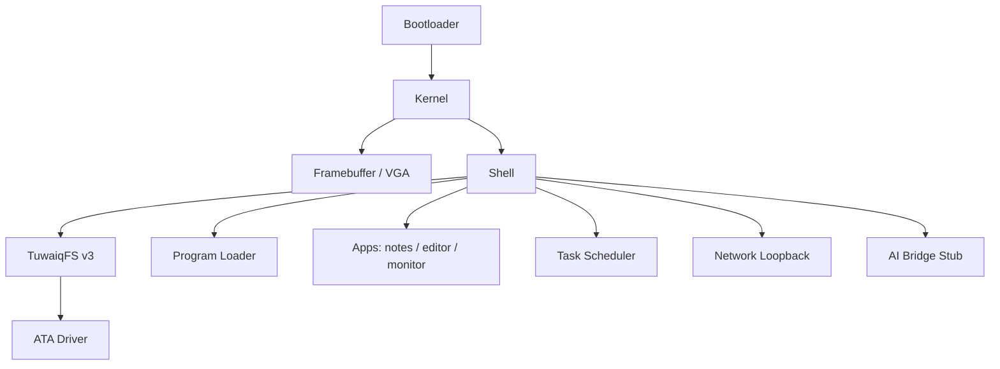

# TuwaiqOS

Experimental AI-Native Operating System written in Rust.

TuwaiqOS is a bare-metal `no_std` OS that boots in QEMU, provides a terminal shell, recoverable persistent storage (TuwaiqFS v3), preemptive multitasking, loopback networking, and an AI bridge stub for future integration.

```text
TuwaiqOS v0.5
AI-Native Experimental Operating System

tuwaiq@os:~$
```

## Screenshots

> Add screenshots of the boot screen and shell after running in QEMU.
> Suggested captures: boot banner, `monitor`, `run hello`, filesystem persistence test.

## Architecture



See [ARCHITECTURE.md](ARCHITECTURE.md) for subsystem details.

## Requirements

- Rust nightly (`nightly-2026-06-01`, pinned in `rust-toolchain.toml`)
- QEMU (`qemu-system-x86_64`)
- Windows: MSVC Build Tools
- `rust-src` and `llvm-tools-preview` components

## Build

Windows (PowerShell):

```powershell
cd path\to\TuwaiqOS
.\scripts\build.ps1
```

Linux/macOS:

```bash
cd path/to/TuwaiqOS
./scripts/build.sh
```

Output: `target\debug\boot-bios-tuwaiqos.img`

## Run in QEMU

```powershell
.\scripts\run-qemu.ps1
```

Manual:

```powershell
qemu-system-x86_64 -drive format=raw,file=target\debug\boot-bios-tuwaiqos.img -m 128M
```

## Run in VirtualBox

1. Create a new VM (Other/Unknown 64-bit, 128 MB RAM).
2. **Do not** attach an ISO — use the raw disk image instead.
3. Settings → Storage → Add hard disk → choose `boot-bios-tuwaiqos.img`.
4. Display: VMSVGA or default; 1280×720 works well with the framebuffer console.
5. Start the VM.

Alternatively convert the image to VDI:

```powershell
VBoxManage convertfromraw target\debug\boot-bios-tuwaiqos.img target\debug\tuwaiqos.vdi --format VDI
```

## Validation checklist

```text
help
ls
touch hello.txt
write hello.txt hello
cat hello.txt
reboot
cat hello.txt          # must show: hello
ps
sysinfo
notes create todo
notes list
monitor
run hello
```

## Project layout

```text
TuwaiqOS/
├── kernel/src/       # Bare-metal kernel
├── scripts/          # build.ps1, run-qemu.ps1
├── docs/             # Architecture and filesystem docs
├── build.rs          # Disk image builder
└── Cargo.toml        # Workspace root (tuwaiqos package)
```

## Roadmap

See [ROADMAP.md](ROADMAP.md).

## Contributing

See [CONTRIBUTING.md](CONTRIBUTING.md).

## License

MIT — see [LICENSE](LICENSE).

## Release

Current version: **TuwaiqOS v0.5** — see [RELEASE_NOTES.md](RELEASE_NOTES.md).
