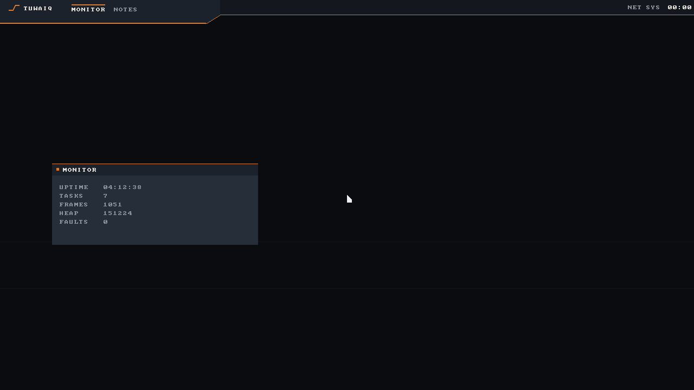
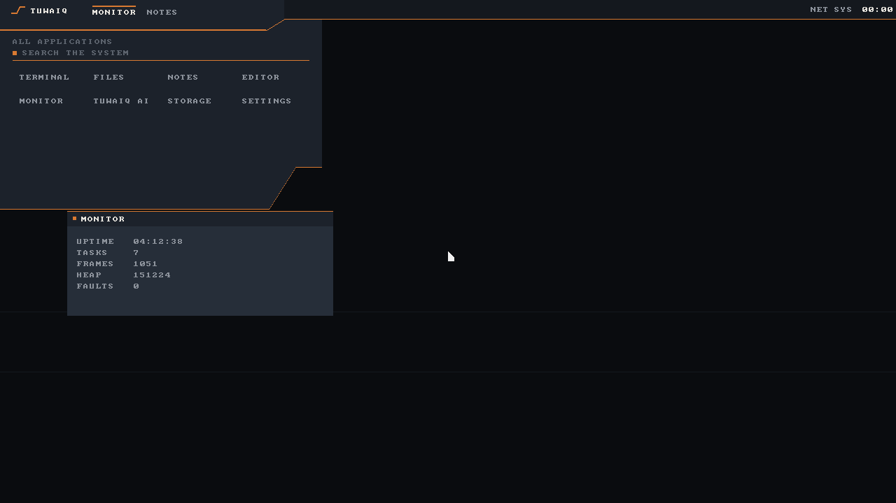
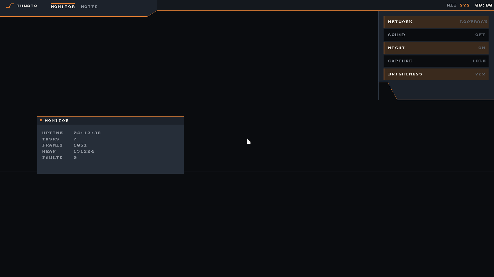
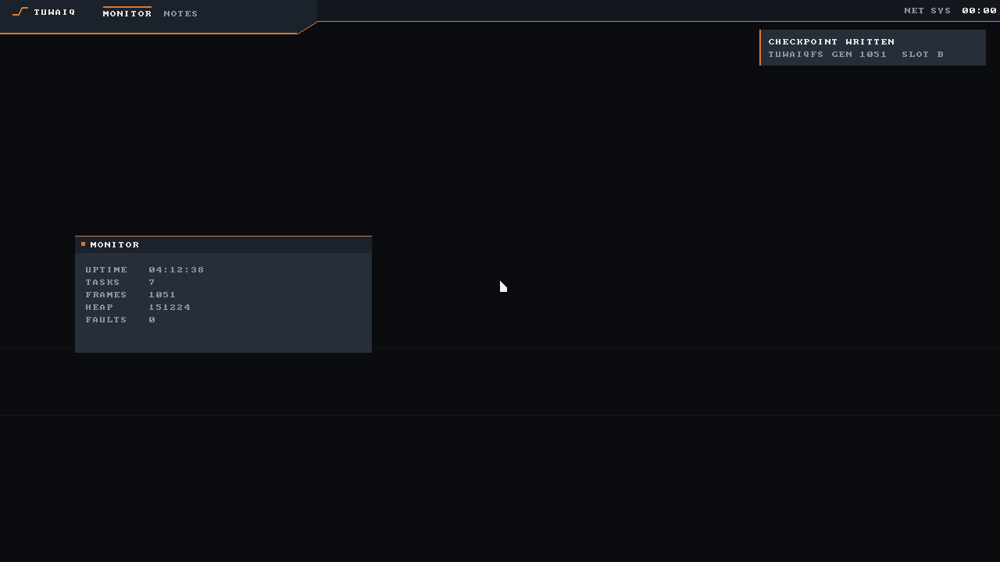
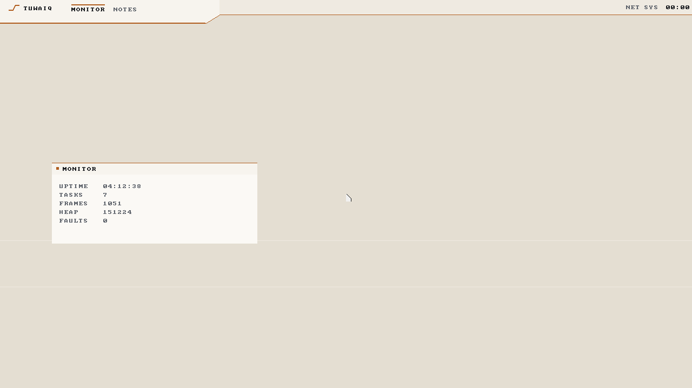
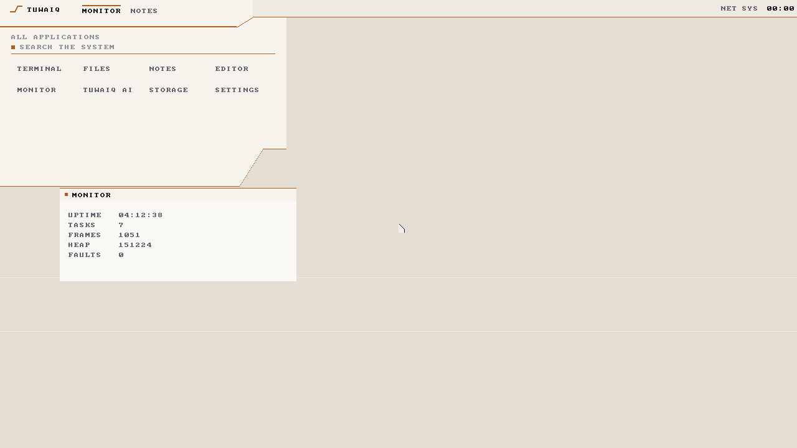

# Tuwaiq Shell

An interface identity prototype

```
tuwaiqshell
```



## The idea in one line

Tuwaiq is a plateau one sharp break and a lower plain and that silhouette is
the shape of the panel rather than a picture hung behind it

## Why it is a separate program

`desktop` is covered in detail by `scripts/phase5-acceptance.ps1` which asserts
drag close launcher focus lifecycle and resource baselines against that exact
binary

This is a second program rather than a change to it so those assertions keep
testing what they always tested and bold interface ideas can be tried with
nothing at risk Run one then the other and compare

It reuses `desktop/gfx.rs` `desktop/font.rs` and `desktop/sys.rs` verbatim by
path rather than copying them so the rendering and syscall paths stay the ones
already in use Everything new lives in `userland/hello/src/bin/tuwaiq_shell/`

## Four rules

**The panel has a step in it**

The system zone sits on a deeper plateau the task zone on a lower plain and one
angled break joins them A vertical drop would read as a mistake so the break is
26 pixels wide and reads as terrain No other desktop has a non rectangular
panel which is what makes this identifiable before a word is read

**Depth is a lit edge and never a shadow**

One copper hairline runs the profile the way first light catches a cliff rim
Two pixels on the plateau and one on the plain so the deeper mass reads as
closer to the light rather than merely taller It stays sharp at any resolution
and costs one pixel per column

**Panels rise they do not float**

The launcher does not fade in over your work The plateau grows upward and the
grid is already carved into it One vertical motion no scale and no opacity



**Copper means the system acted**

Focus running on unread That is the whole list Copper is never a border for its
own sake and never a gradient Everything else is charcoal and stone which is
what stops one warm hue reading as a theme swap

In the shot above `MONITOR` carries a copper cap because it is running `NOTES`
does not The window has a copper top edge because it has focus

## Quick settings are strata

Every desktop draws toggles as round pills because every desktop copies the
same phone These are horizontal bands that fill copper from the leading edge so
a panel of settings reads as rock layers and a toggle reads as a layer being lit



Note the tray reading `SYS` in copper while the console is open and the
console's own break mirroring the panel's so the two silhouettes bracket the
screen

Filling from the leading edge rather than the left means the fill still travels
toward the reader once the shell is mirrored for Arabic

## Notifications land on the ledge

They sit on the shelf below the plain rather than floating over the work and
carry the same copper edge as everything else



## Light is limestone not an inversion

The same escarpment at midday sand and limestone grounds with a deeper copper
that holds its contrast on a pale surface





Inverting the dark palette would have produced a grey blue office theme with no
relationship to the identity so the light theme is authored separately in
`theme.rs`

## Controls

| | |
|---|---|
| click the mark or `A` | raise the launcher |
| click `SYS` or `S` | pull the console |
| `N` | post a notification |
| `L` | swap light and dark |
| `Esc` | exit |

## What it costs

Measured over a 24 second session ending in `Esc` which prints the line itself

```
tuwaiq-shell: frames=143 ticks=2457 fps_x100=582 buffer_bytes=2764800
```

| | |
|---|---|
| Frame rate | 5.82 per second |
| Backbuffer | 2 764 800 bytes which is 2.64 MiB and one `SYS_MMAP` |
| Executable | 23 328 bytes |
| Background cost | none since it is only scheduled while it is the foreground process |

**5.82 frames per second is the existing renderer and not something this adds**

`gfx::put_pixel` writes one pixel per call with a bounds check and a pixel
format branch and a full 1280x720 frame is 921 600 of those `desktop` pays the
same price The shell does not add a compositor a cache or a dirty region model
because doing so would be changing the renderer rather than proposing an
identity

It does change one thing that measurement forced Animation is driven by the
100 Hz timer rather than by frame count The first version counted frames and a
340 ms rise took over a second and varied with whatever else was running
`ridge::offset` and `console::offset` now take elapsed ticks so the motion is
correct regardless of frame rate

## Files

```
userland/hello/src/bin/tuwaiq_shell/
  main.rs         state input frame loop and the cost line
  theme.rs        the palette both themes
  escarpment.rs   the profile every surface shares
  ridge.rs        the launcher
  console.rs      quick settings
docs/gui/         the screenshots above
```

Outside that directory three lines of registration

| File | Change |
|---|---|
| `kernel/src/shell.rs` | one `embedded_program` arm one dispatch entry and `handle_tuwaiq_shell` |
| `scripts/build.ps1` | `tuwaiq_shell` added to the binary manifest so a missing build fails the build rather than the test |

`handle_tuwaiq_shell` is `handle_desktop` with a different program The same
`spawn_foreground_process` the same input ownership the same release and reap
No new privilege no new service and no new lifecycle

## No new dependencies

Nothing was added to any `Cargo.toml`

## Not done

- **Arabic** RTL is proven in geometry only The 8x8 font is Latin bitmap and
  shaping is unsolved here It would need the build time raster approach the
  boot mark uses
- **Search** is drawn not designed Ranking scopes and the keyboard model are
  open and there is no text input model in the desktop to build on
- **Launching** the grid closes and posts a notification rather than spawning
  A real launch is `sys::spawn` and was left out so the gesture is not
  confused with a working app menu
- **Window management** is one static window Drag focus close tiling and
  workspaces are deliberately untouched until the panel identity is settled
- **The tray** has two entries because two is what the system reports It needs
  a model before it needs a design
- **Frame rate** see above This proposes an identity and not a renderer
